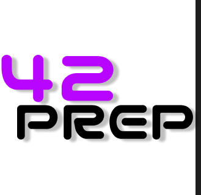

# 42-Prepare

This is an open-source Program for 42 students to practice coding exercises without violating the Terms of Service.

## Installation

git clone https://github.com/yourusername/42-prepare.git
cd 42-prepare
chmod +x prep

## Usage

Run the program using:

./prep

The program will prompt:

Pick your exam:
1) Piscine
2) Common Core

If you select **Common Core**, the program will display:

Pick an exam:
1) Exam 02
2) Exam 03
3) Exam 04
4) Exam 05
5) Exam 06

After selecting an exam, a random exercise will be chosen from the available subjects. You will need to complete the exercise in the `rendu/` directory. The exercise will have a corresponding subject file explaining the requirements.

Once you finish, run:
./prep correct

If your solution is correct, you will earn **25 points**. If incorrect, you can retry until you get it right.
